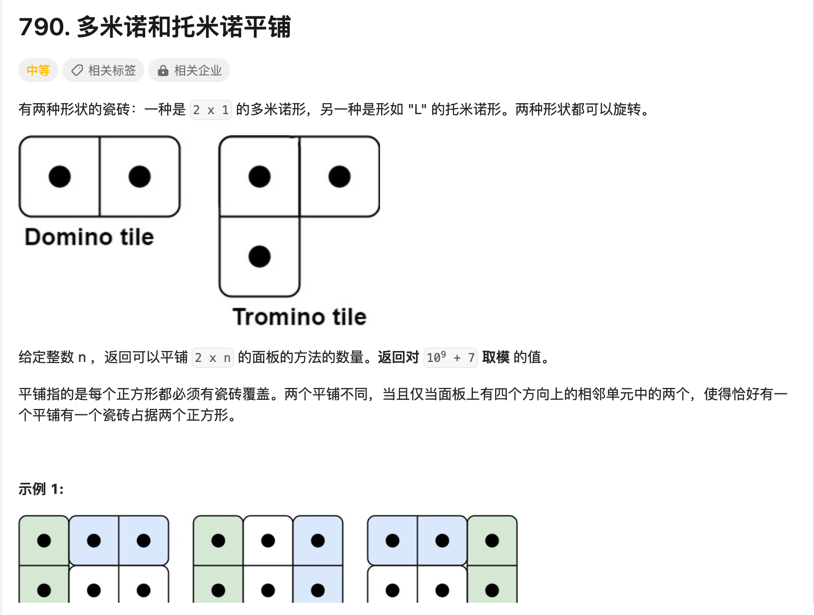

[题目](https://leetcode.cn/problems/domino-and-tromino-tiling/description/?envType=study-plan-v2&envId=leetcode-75)


# 思路
**动态规划**
定义dp[i][j]表示第i列的状态为j的方案数，j=0或1，其中j=0表示该列全满，j=1表示该列半满，如下图所示：


# 解题方法
因为题目中的方块只能跨越两列，所以我们只需考虑状态dp[i] 与 dp[i-1]、dp[i-2]之间的关系，显然：
欲使i列全满我们有三种情况：

即：
```Go
dp[i][1] = dp[i-1][0] + dp[i-2][1] + dp[i-1][1]
```
欲使i列半满我们也有三种情况：


即：
```Go
dp[i][0] = dp[i-1][0] + dp[i-2][1]*2
```

根据实际我们得到初始2个状态：

`	dp[0] = [0,1]
dp[1] = [0,1]`

递推下去，问题解决！


# Code
```Go 

func numTilings(n int) int {

	if n <= 1 {
		return 1
	}
	dp := make([][]int, n+1)
	for i := 0; i < len(dp); i++ {
		dp[i] = make([]int, 2)
	}
	dp[0][0], dp[0][1] = 0, 1
	dp[1][0], dp[1][1] = 0, 1

	for i := 2; i <= n; i++ {
		dp[i][0] = (dp[i-1][0] + dp[i-2][1]*2) % 1000000007
		dp[i][1] = (dp[i-1][0] + dp[i-2][1] + dp[i-1][1]) % 1000000007
	}
	return dp[n][1]
}
```
结果：
