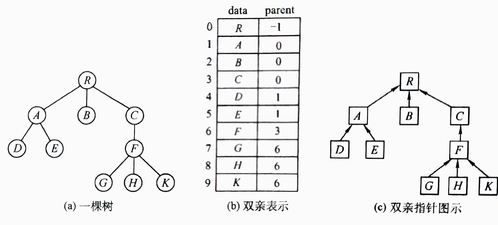
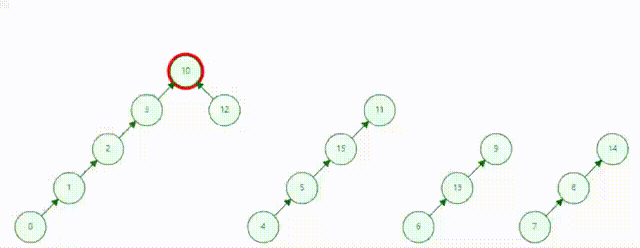

## 并查集

### 1. 概念

并查集主要用于解决一些 元素分组 问题，通过以下操作管理一系列不相交的集合：

    合并（Union）：把两个不相交的集合合并成一个集合
    查询（Find）：查询两个元素是否在同一个集合中

>具体实现方面，使用一个数组 parent 存储每个变量的 父节点信息（每个节点的连通分量信息），其中的每个元
素表示当前变量所在的连通分量的父节点信息，如果父节点是自身，说明该变量为所在连通分量的根节点。初始化时
所有变量的父节点都是它们自身
> 

### 2. 解题技巧（我的总结）

> 1> 合并集合，两个集合有相似的性质，合并二者，以前一个集合的索引作为根。
> 性质map为空
> 对每个集合m, 索引i{
>   如果 m的性质 在 性质map 中 存在, 根为preIdx{
>       i 加入 preIdx
>   }否则{
>       性质map添加新健值对 (m性质, i)
>   }
> }
> 
| 题目                                                                   | 说明                                           | 实现                                                                            |
|----------------------------------------------------------------------|----------------------------------------------|-------------------------------------------------------------------------------|
| [947. 移除最多的同行或同列石头](https://leetcode.cn/problems/most-stones-removed-with-same-row-or-column/description/) | 相同性质为：两个集合拥有相同的行号或列号，用一个map记录每个行号、列号第一次出现的位置 | [我的提交](https://leetcode.cn/problems/most-stones-removed-with-same-row-or-column/submissions/479031530/) |
| [721. 账户合并](https://leetcode.cn/problems/accounts-merge/description/) | 相同性质为：两个集合拥有相同的元素，用一个map记录每个元素第一次出现的位置       | [我的提交](https://leetcode.cn/problems/accounts-merge/submissions/478917176/) |
| [1722. 执行交换操作后的最小汉明距离](https://leetcode.cn/problems/minimize-hamming-distance-after-swap-operations/description/) | AB交换、BC交换、...EF交换 <-> A、B、C、...、F可以任意交换      | [我的提交](https://leetcode.cn/problems/minimize-hamming-distance-after-swap-operations/submissions/483814512/) |

### 3. 更多练习
**基础**

| 题目                                                         | 说明                                               | 答案                                                      |
| ------------------------------------------------------------ | -------------------------------------------------- | --------------------------------------------------------- |
| [990. 等式方程的可满足性](https://leetcode.cn/problems/satisfiability-of-equality-equations/) | 先将==全部合并，其次找出!=的根节点，如果一样则不行 | [通过](https://leetcode.cn/submissions/detail/136424817/) |
| [547. 省份数量](https://leetcode.cn/problems/number-of-provinces/) | 简单的并查集，维护连通分量个数，也可以 DFS 和 BFS  | [通过](https://leetcode.cn/submissions/detail/375522024/) |

**进阶**

| 题目                                                         | 说明                                                         | 答案                                                         |
| ------------------------------------------------------------ | ------------------------------------------------------------ | ------------------------------------------------------------ |
| [959. 由斜杠划分区域](https://leetcode.cn/problems/regions-cut-by-slashes/) | 重点在将斜杠怎样拆分成单元格，外部添加成3\*3（还可以DFS），内部分解成4\*4 | [通过](https://leetcode.cn/submissions/detail/141243167/)   [DFS](https://leetcode.cn/submissions/detail/375476296/) |
| [721. 账户合并](https://leetcode.cn/problems/accounts-merge/) | 维护账户到id的哈希表`mail2id`以及id到账户数组的哈希表`id2mails`，合并含有相同账户的id | [通过](https://leetcode.cn/submissions/detail/375528105/)    |
| [1697. 检查边长度限制的路径是否存在](https://leetcode.cn/problems/checking-existence-of-edge-length-limited-paths/) | 离线查询（询问全部给出，但是没必要按照**询问的顺序**处理，可以排序之后离线处理），注意自定义 sort 排序时最好加上引用`&` | [通过](https://leetcode.cn/submissions/detail/389035257/)    |
| [2503. 矩阵查询可获得的最大分数](https://leetcode.cn/problems/maximum-number-of-points-from-grid-queries/) | 可以考虑`点权`或者`边权`（边权就考虑较大边），排序之后然后**离线查询**，询问排序下标就可以，可以看看灵神视频题解 | [边权](https://leetcode.cn/submissions/detail/389036925/)   [点权](https://leetcode.cn/submissions/detail/389025813/) |
| [1584. 连接所有点的最小费用](https://leetcode.cn/problems/min-cost-to-connect-all-points/) | Kruskal 算法：构造边，排序之后合并连通分量，维护分量长度和节点个数 | [通过](https://leetcode.cn/submissions/detail/389340427/)    |

- [ ]  [399. 除法求值](https://leetcode.cn/problems/evaluate-division/)
- [ ]  [803. 打砖块](https://leetcode.cn/problems/bricks-falling-when-hit/)
- [ ]  [1202. 交换字符串中的元素](https://leetcode.cn/problems/smallest-string-with-swaps/)

### 4. 参考
1. [使用并查集处理不相交集合问题（Java、Python）](https://leetcode.cn/problems/satisfiability-of-equality-equations/solution/shi-yong-bing-cha-ji-chu-li-bu-xiang-jiao-ji-he-we/)
2. [「手画图解」手写UnionFind，并查集 不再畏惧](https://leetcode.cn/problems/satisfiability-of-equality-equations/solution/shou-hui-tu-jie-shou-xie-unionfind-bing-cha-ji-bu-/)
3. [LC2503：两种写法：离线询问 + 并查集 / 最小堆（Python/Java/C++/Go）](https://leetcode.cn/problems/maximum-number-of-points-from-grid-queries/solution/by-endlesscheng-qeei/)