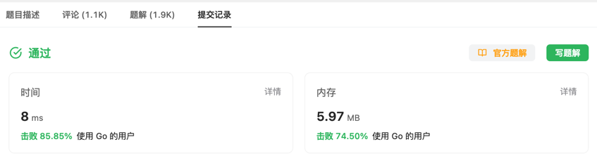

##### [题目](https://leetcode.cn/problems/kth-smallest-element-in-a-bst/?envType=study-plan-v2&envId=top-interview-150)

##### 思路
> 设置一个计数器i，中序遍历，每读一个val就i++，直到i==k时记录val

##### 解题方法
> 再设置一个标记done，当得到结果后设置为true，每次遍历前先判断done，为true时直接return。直接减少后续不必要的遍历。耗时从8ms->4ms
##### 结果：

