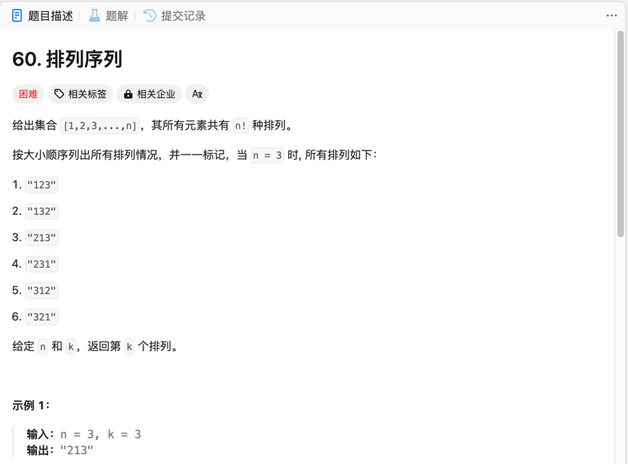

##### [题目](https://leetcode.cn/problems/permutation-sequence/description/)

##### 思路
> 如何减少时间消耗，考虑使用位运算

##### 解题方法
> x，y表示a、b当前位是否为‘1’，c表示上一位的进位，则：
结果的当前位 = x 异或 y 异或 c
x&&y时，下一位的进位 = true
!x&&!y时，下一位的进位 = false
其他情况，c保持不变
循环上述过程。

##### 结果：

