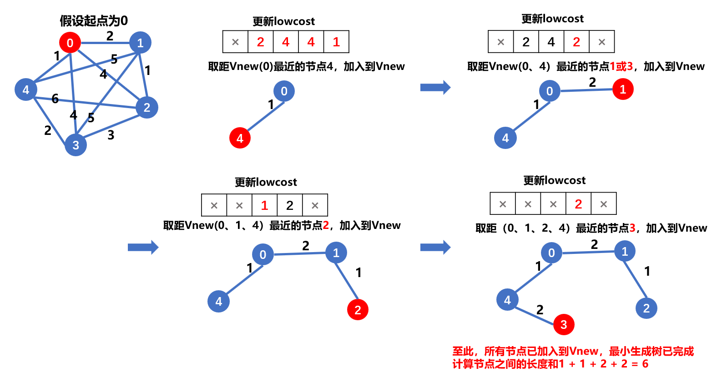
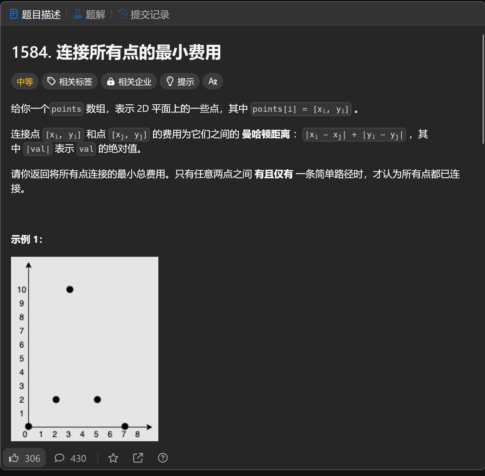
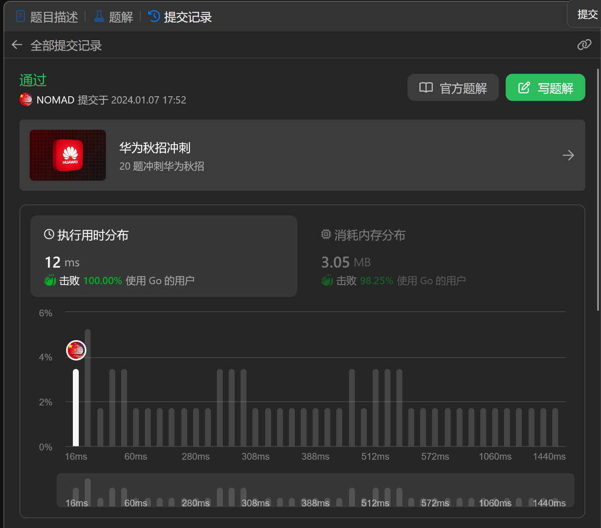

#### prim算法

##### 核心思想
贪心思想，prim算法的主要思想就是让一棵小树不断得到新的树边，直到长成所有节点都在树集合中的大树。

循环：
①先将图拆解成森林
②以任意一个顶点为出发点，通过对到其他顶点的权值进行比较，找到最小边得到一颗树(顶点，边)集合
③将②中的”顶点“换成“这颗树”与其他顶点是否有更小的权值
④重复第③步就可以得到最小生成树

##### Prim算法的优点：
比起kruskal算法来讲，prim算法可以不用判断是否产生回路，因为在待选边表中不停计算的过程中，可以有效避免产生回路的情况，可以不学并查集（有时还要学习堆），快速恶补，并且适用于稠密图，其时间复杂度只与节点数量有关，在特定情况下可以更快的执行完程序。

##### Prim算法 的缺点：
prim算法适用于稠密图，但是稀疏图还是kruskal算法更胜一筹

##### [题目](https://leetcode.cn/problems/min-cost-to-connect-all-points/description/)

##### 结果：
