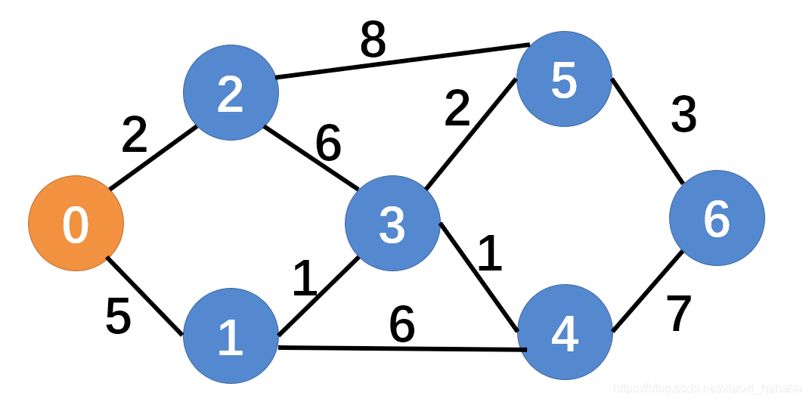
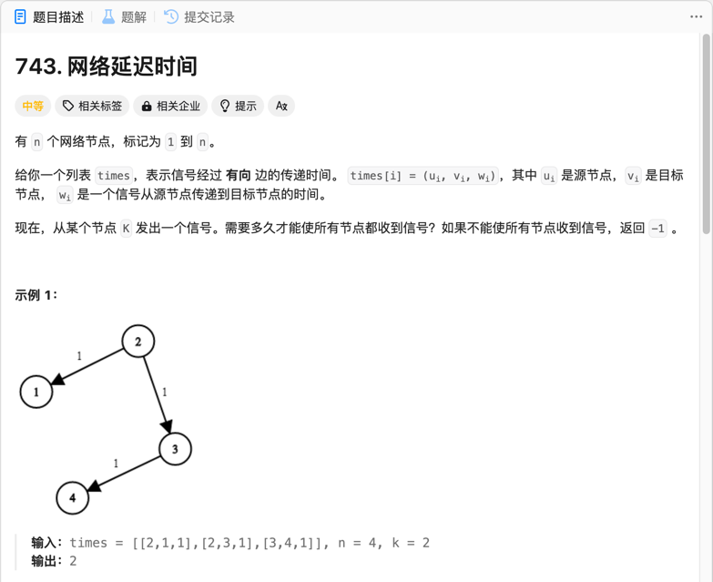

#### dijkstra算法

##### 核心思想
源点K，设置两个集合分别是A和B，A用来存放已经求出最短路径的点，B用来存放还未计算出最短路径的点

循环：
1. 在集合B中选定距离K最短的一个点P
2. 对于这个点P的所有邻近点去尝试松弛
3. P加入集合A

##### 注意事项
1. 只能解决单源最短路径问题
2. 不能处理带有负权边的图(可能得不到最优解，认为是无法处理负权图)，只能处理非负权图。

##### [题目](https://leetcode.cn/problems/partition-to-k-equal-sum-subsets/)

##### 结果：
