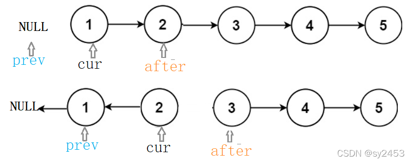
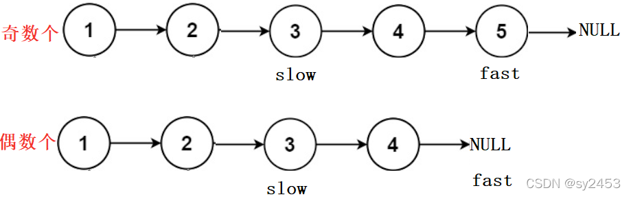
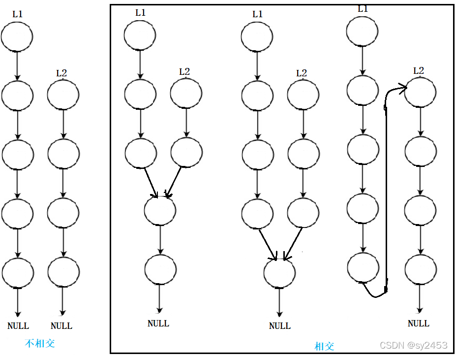
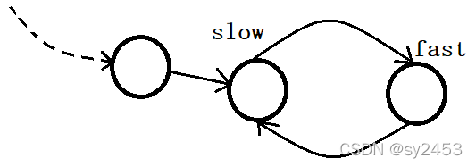

## 链表

### 1. 概念

1. 反转链表
给出3个指针，一个cur，用于遍历链表中的每个节点，一个prev，用于保存cur指向的节点的上一个节点地址，还有一个after，用于保存cur指向的节点的下一个节点地址，链表操作遵循先连后断，

2. 给定一个头结点为 head 的非空单链表，返回链表的中间结点。如果有两个中间结点，则返回第二个中间结点。
用快慢指针的方法解决，一个快指针fast,一个慢指针slow，开始时，都让他们指向链表的头节点，然后fast每次向后遍历两个节点，而slow每次往后遍历一个节点，循环这两步操作，循环结束条件是：当单链表有偶数个节点时，fast先遇到空指针NULLL；当单链表有奇数个节点时，fast->next先遇到空指针NULL。

3. 输入一个链表，输出该链表中倒数第k个结点。
(1).先定义两个节点指针，一个front,一个back,开始时都让他们指向链表的头节点；(2).先让front走k步(有可能front还没走完k步就已经到达链表的末尾，说明倒数第k个节点肯定没有，就没必要再执行下一步，直接返回NULL) ；(3).front和back同时往后走，当front到达链表末尾时，back恰好在倒数第k个节点的位置。

4. 将两个升序链表合并为一个新的 升序 链表并返回。
(1).定义一个带头结点空链表，再定义一个尾指针tail用来指向新链表的尾节点，便于后续尾插；另外再定义两个指针，一个cur1,用于遍历链表list1,一个cur2,用于遍历链表list2;(2).当cur1和cur2每遍历一个节点时，比较两个节点的值，让值小的那个节点尾插到新链表，并让指针往后走一步，另一个指针不动，循环操作，直到其中一个链表被遍历完；(3).循环结束后，看哪一个链表不为空，就把尾指针tail指向不为空的那一部分;(4).返回新链表头节点的指针域的值。

5. 判断单链表是不是回文结构
(1).用快慢指针的思想找到原链表的中间节点；(2).反转后半段链表；(3).判断前半段与后半段是否相等；(4).再将后半段逆置，恢复原链表。

6. 两个链表（不带环）相交
检测两个链表（不带环）是否相交：(1).找到两个链表的最后一个节点；(2).检测两个链表的最后一个节点是否相同。
求两个相交链表（不带环）的节点：(1).分别求出两个链表的节点个数；(2).定义两个指针，分别指向两个链表的头节点；(3).让指向较长链表的指针先遍历两链表节点个数差值个节点；(4).让两个指针同时往后遍历，并检测节点是否相同，若相同，则该节点就是交点。

7. 给定一个链表，判断链表中是否有环。
思路：快慢指针，即慢指针一次走一步，快指针一次走两步，两个指针从链表其实位置开始运行，如果链表带环则一定会在环中相遇，否则快指针率先走到链表的末尾。

>1.为什么快指针每次走两步，慢指针走一步可以？
假设链表带环，两个指针最后都会进入环，快指针先进环，慢指针后进环。当慢指针刚进环时，可
能就和快指针相遇了，最差情况下两个指针之间的距离刚好就是环的长度。此时，两个指针每移动
一次，之间的距离就缩小一步，不会出现每次刚好是套圈的情况，因此：在满指针走到一圈之前，
快指针肯定是可以追上慢指针的，即相遇。

>2.快指针一次走3步，走4步，...n步行吗？
假设:快指针每次走3步，满指针每次走一步,此时快指针肯定先进环，慢指针后来才进环。假设慢指针进环时候，快指针的位置如图所示:
此时按照上述方法来绕环移动，每次快指针走3步，慢指针走1步,是永远不会相遇的，快指针刚好将慢指针套圈了，因此不行。
只有快指针走2步,慢指针走一步才可以，因为换的最小长度是1,即使套圈了两个也在相同的位置。

### 2. 解题技巧（我的总结）

> 1> 链表递归修改、查询
> 
| 题目                                                                        | 说明                          | 实现                                                                            |
|---------------------------------------------------------------------------|-----------------------------|-------------------------------------------------------------------------------|
| [430. 扁平化多级双向链表](https://leetcode.cn/problems/flatten-a-multilevel-doubly-linked-list/) | 设func(l)可以扁平化子链表l，递归修改      | [我的提交](https://leetcode.cn/problems/flatten-a-multilevel-doubly-linked-list/submissions/470308756/) |
| [2058. 找出临界点之间的最小和最大距离](https://leetcode.cn/problems/find-the-minimum-and-maximum-number-of-nodes-between-critical-points/description/) | 保存某个节点往后的极点中的最大和最小位置，递归查找计算 | [我的提交](https://leetcode.cn/problems/find-the-minimum-and-maximum-number-of-nodes-between-critical-points/submissions/497488297/) |
| [2074. 反转偶数长度组的节点](https://leetcode.cn/problems/reverse-nodes-in-even-length-groups/description/) | 每次跳到一个组的末尾，看是否要反转下一个组，递归    | [我的提交](https://leetcode.cn/problems/reverse-nodes-in-even-length-groups/submissions/497501976/) |
| [2095. 删除链表的中间节点](https://leetcode.cn/problems/delete-the-middle-node-of-a-linked-list/description/) | 参数中记录前面多少节点，返回值记录后面多少节点     | [我的提交](https://leetcode.cn/problems/delete-the-middle-node-of-a-linked-list/submissions/497799186/) |

### 3. 更多练习

### 4. 参考
1. [基础算法-链表](https://blog.csdn.net/sy2453/article/details/122571058) 